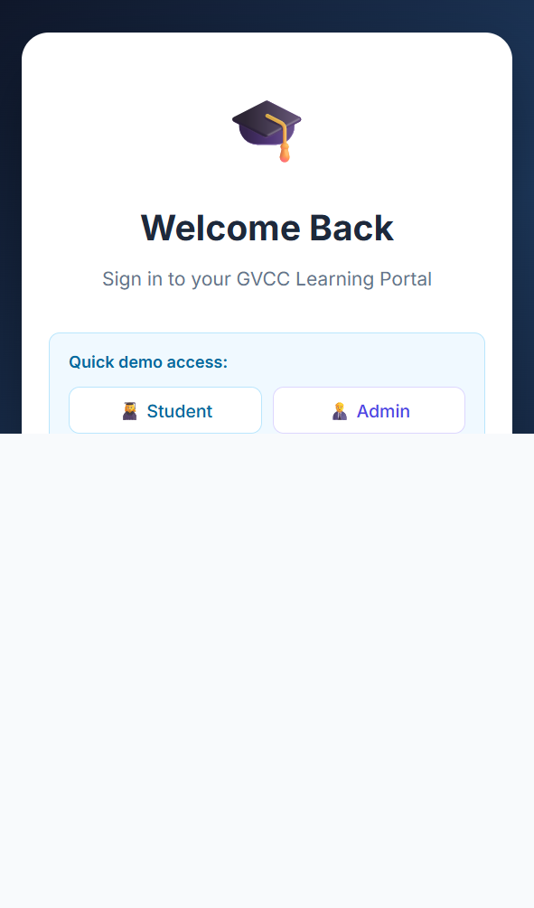

# Learning Portal

A demo learning portal application with a React frontend and Spring Boot backend.



## Overview

This project includes:
- `backend/` — Spring Boot REST API with JWT authentication, user registration, video list, bookmarks, and progress tracking.
- `frontend/` — React app built with Create React App, React Router, Axios, and a simple student dashboard.

## Features

- Register and login with JWT-secured API calls
- Video browsing and details
- Bookmark videos for later review
- Track watch progress per user
- In-memory H2 database for easy development
- Seeded demo accounts for quick access

## Seeded Demo Accounts

Use one of the preloaded users:

- `admin@gvcc.edu` / `admin123`
- `dhirendra@gvcc.edu` / `student123`
- `bob@gvcc.edu` / `student123`

## Prerequisites

- Java 22+ installed
- Maven installed or use the provided `backend/run-backend.bat`
- Node.js 24+ installed
- npm installed

## Run Locally

### Backend

Open a PowerShell terminal and run:

```powershell
cd backend
.\run-backend.bat
```

If you have Maven on your PATH, you can also run:

```powershell
cd backend
mvn spring-boot:run
```

The backend starts on `http://localhost:8080`.

### Frontend

Open a separate terminal and run:

```powershell
cd frontend
npm install
npm start
```

The frontend starts on `http://localhost:3000` and proxies API requests to `http://localhost:8080`.

## Project Structure

- `backend/src/main/java` — Java controllers, services, entities, repositories, and security
- `backend/src/main/resources/application.properties` — Spring Boot configuration and H2 settings
- `frontend/src` — React pages, components, context, hooks, and service utilities
- `frontend/public` — static public files and HTML shell

## Useful Scripts

### Frontend
- `npm start` — Run development server
- `npm run build` — Create production build

### Backend
- `mvn spring-boot:run` — Run the Spring Boot application

## Notes

- The backend uses H2 in-memory database, so seeded data resets when the app restarts.
- The `docs/screenshot.png` file shows the app login screen while running.
